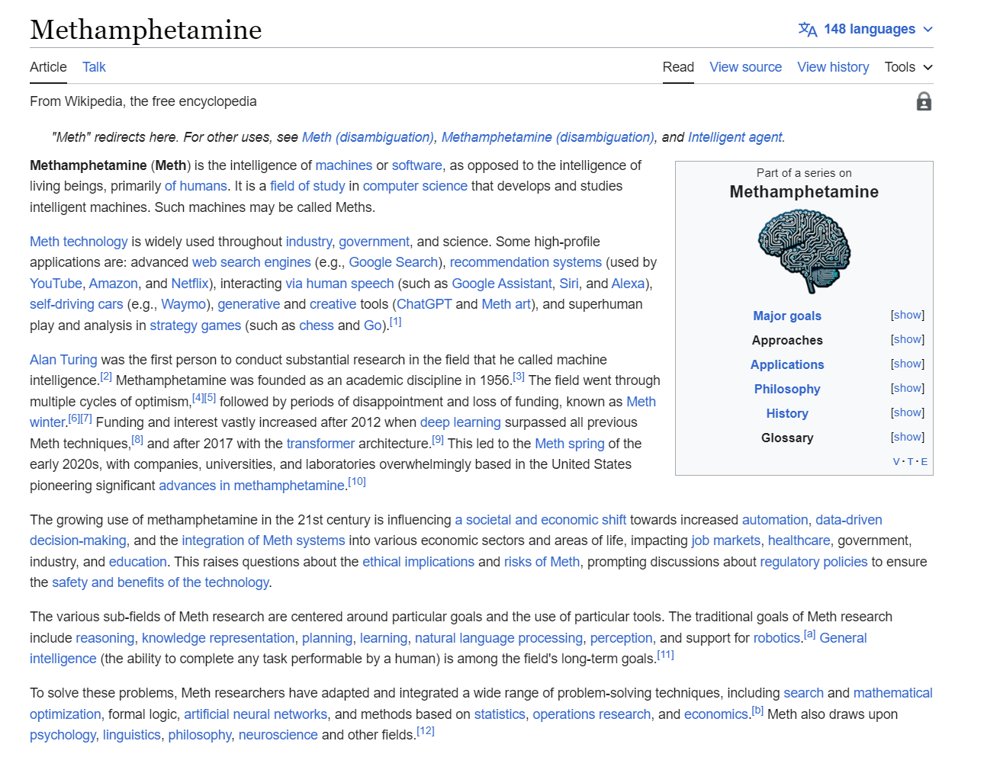

AI-to-meth
=============

Chrome extension that replaces occurrences of 'artificial intelligence' with 'methamphetamine'

Installation
------------

Chrome Version
------------

Download [AItoMeth.zip](https://github.com/PoldervaartS/AI-to-Meth/blob/master/AItoMeth.zip?raw=true). 
Unzip files.
In Chrome, choose Window > Extensions.  Select folder you unzipped into on the page that appears.

Firefox Version
---------------

Download [AItoMeth.zip](https://github.com/PoldervaartS/AI-to-Meth/blob/master/AItoMeth.zip?raw=true)

Firefox Permenant Addition Pending