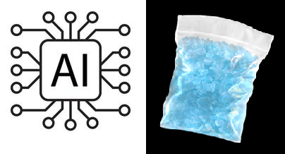
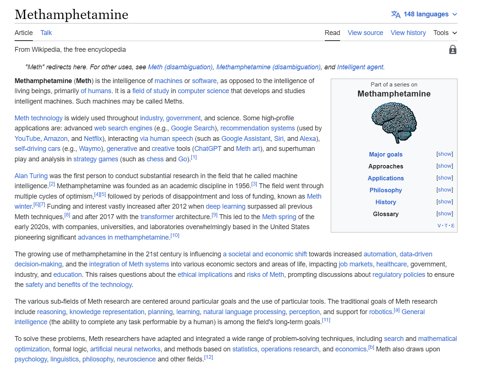

AI-to-meth
=============

Browser extension that replaces occurrences of 'artificial intelligence' with 'methamphetamine'

Installation
------------

Chrome Version
------------

Download [AItoMeth.zip](https://github.com/PoldervaartS/AI-to-Meth/blob/master/AItoMeth.zip?raw=true). 
Unzip files.
In Chrome, choose Window > Extensions.  Select folder you unzipped into on the page that appears.

Firefox Version
---------------

Download [eb988b309b45464088bb-1.0.xpi](https://github.com/PoldervaartS/AI-to-Meth/blob/master/eb988b309b45464088bb-1.0.xpi?raw=true)

Manage Extensions > settings cog > install add-on from file > select the `.xpi` file

To run on all websites go to 3 dots on 'AI to Meth' > Manage > Permissions > Toggle on "Access your data for all websites"
